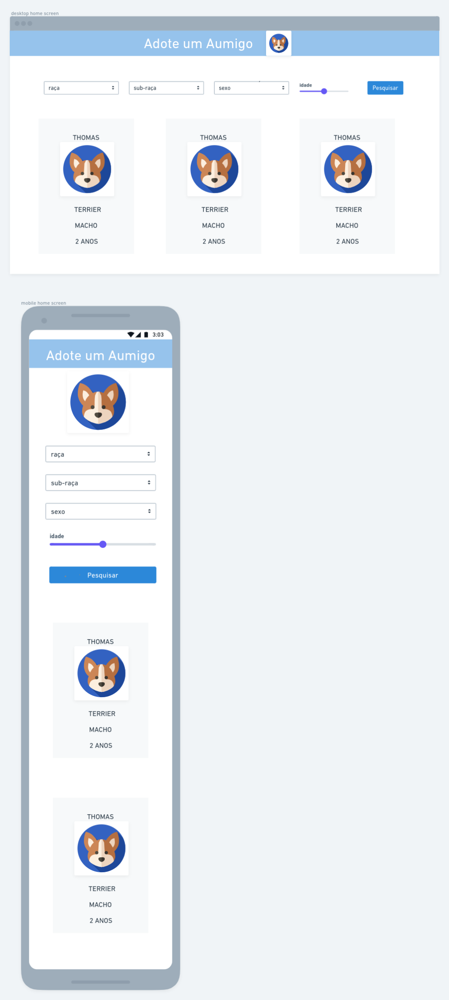

# Adote um amigo

A simple application in react that simulates an adoption application

## Available scripts

- `start:` Start a React script development server
- `build:` Build this React script
- `eject:` As this project use react-scripts by create-react-app, you can eject in order to use webpack or other bundler

## Project Structure(src)

- `/assets` all assets useds and defaults css
- `/components` All  Reacts Components
- `/consts` All apis entrypoint
- `/App.tsx` Where all Providers are used as well as main page
- `/index.tsx` React entrypoinyt

#### Dependencies
- **ESLINT**: linting
- **Material ui**: style
- **React Hook form**: form management
- **axios**: to consume api

### Apis that i used:

**Api for Images and breeds:** [Dog-Api](https://dog.ceo/dog-api/documentation/)

**Api to randomize dog data:** [Adopt-api](https://github.com/jucielly/adopt-api)

## Planning

* First, I started designing the application and how I would like it to look

**Result:**

* then I did the planning and user stories on notion, you can check it out [here](https://www.notion.so/48aef5557c9341fabb30b94314e95c56?v=0e20ad15ee9a479aa419af755bc802b0)

**you can check the final version of the project [here](https://adoteumamigo.jucielly.dev/)**
